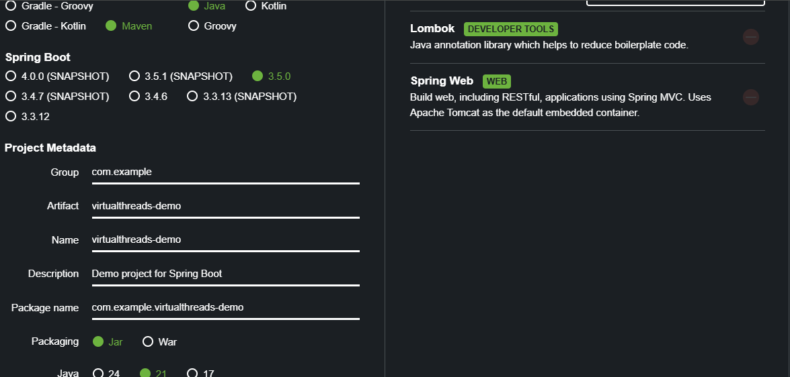
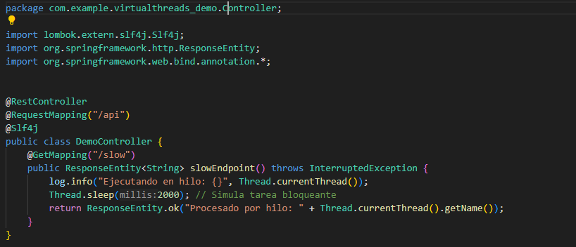
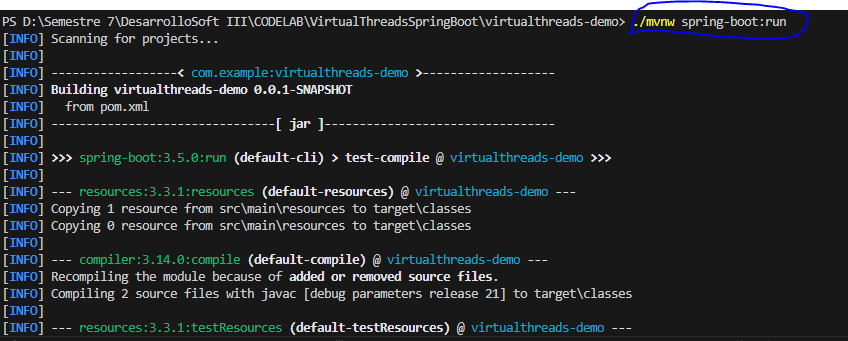
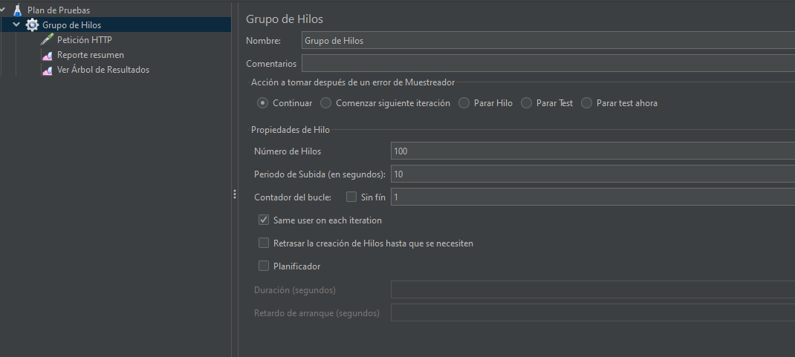
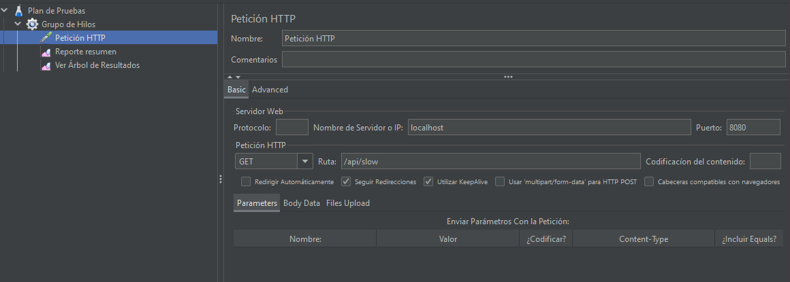
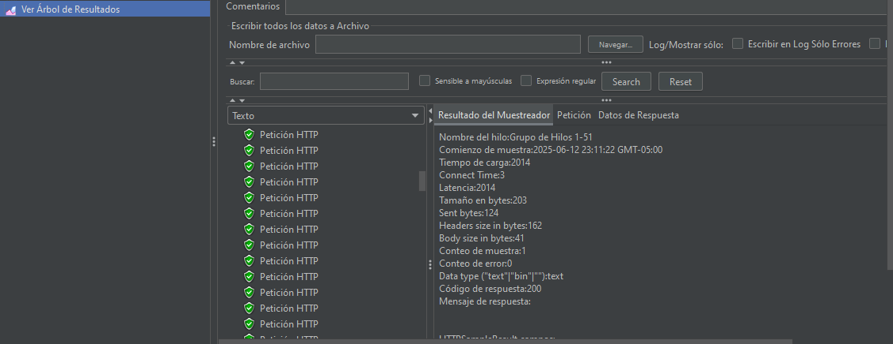
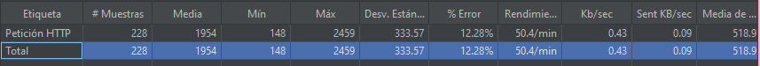
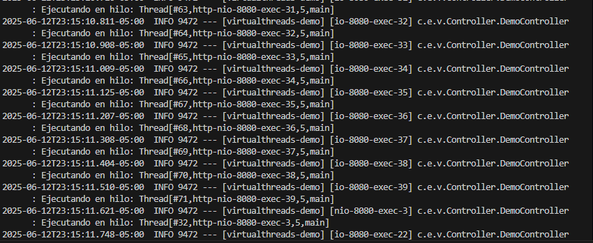

# Virtual Threads en Spring Boot

## Crear el proyecto Spring Boot

Puedes usar Spring Initializr o tu IDE:

- Project: Maven
- Language: Java
- Spring Boot: 3.2.0 o superior
- Dependencies: Spring Web, Lombok (opcional)

Si usas start.spring.io, elige:

- Java 21
- Spring Boot 3.2+
- Group: com.example
- Artifact: virtualthreads-demo

## Configurar virtual threads en Tomcat

Spring Boot 3.2 ya incluye soporte para Tomcat con Virtual Threads.

Esto va en el archivo de application.properties
  

- Esto activa el uso de virtual threads en el thread pool de Tomcat.
  
### Implementar el controlador

- Usamos Lombok (@Slf4j) para el logger

### Ejecutamos el proyecto
  

### Probar con JMeter

##### Preparar prueba en JMeter

- Abre Apache JMeter.
- Agrega un Thread Group:
    - 100 usuarios (threads)
    - Ramp-up: 10 segundos
- Agrega un HTTP Request:
    - URL: http://localhost:8080/api/slow
    - Método: GET
- Agrega un View Results in Table o Summary Report.
- Ejecuta la prueba y observa:
    - Tiempos de respuesta
    - Errores
    - Comportamiento del CPU

### Verificar que se esta usando virtual Threads

### Paso final: Extender o limpiar

Para detener la App precionamos Ctrl + c