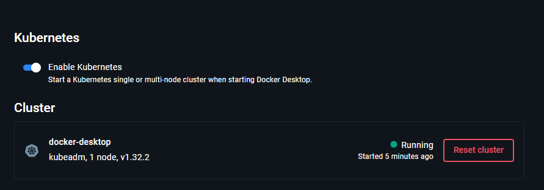
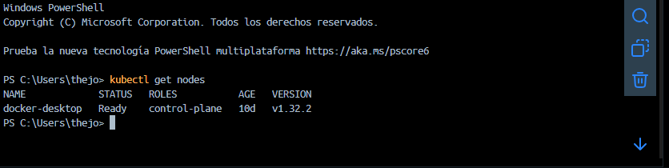
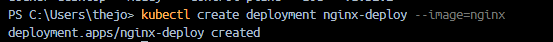
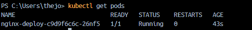
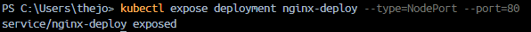
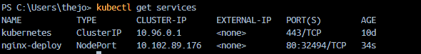
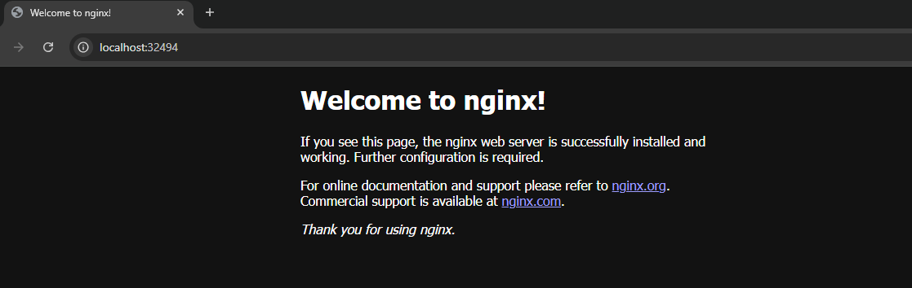
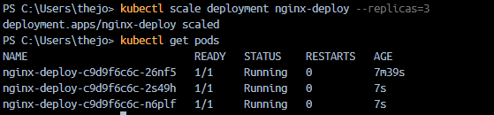
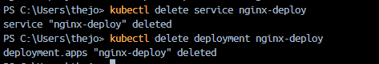

# Introducción Práctica a Kubernetes (Nivel Básico)

## Preparar el entorno

Esto se hizon en windows utilizando Docker Desktop

- Abrimos Docker Desktop.
- vamos a settings > Kubernetes.
- Activamos "Enable Kubernetes".
- Esperamos que aparezca "Kubernetes is running".
- Luego verificamos en una consola el clúster.

## Desplegando nuestra primera aplicación

- Creamos un deployment con nginx

- Verificamos que el pod se esté ejecutando:

- exponemos el servicio

- Revisamos el servicio:

### Accedemos desde el navegador

### Escalamos la aplicación

- Aumentamos el número de replicas a 3:

### Ahora eliminamos todo

- Limpiamos los recursos creados

